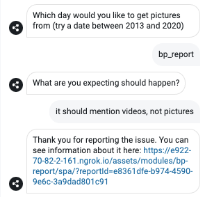

# Botpress Issue Reporter

This is a custom module that allows you to quickly and easily share issues with your conversations in botpress with your team or with the botpress team. 

Note: issues are public, so make sure to only use this while in development.

## Example 

You can report anything, bugs or incorrect wordings, and you'll get a shareable link for your work.

## Getting started
1. Download [bp-report.tgz](./bp-report.tgz)
2. In Botpress go to the modules configuration page
3. Click upload module
4. select the download tgz file
5. submit.
6. restart the server
7. unpack the module
8. activate the module by toggling it on
9. restart botpress
10. in any conversation type "bp_report" to report an issue to us,
11. type in a description of the issue
12. You'll get a link to the conversation information.

